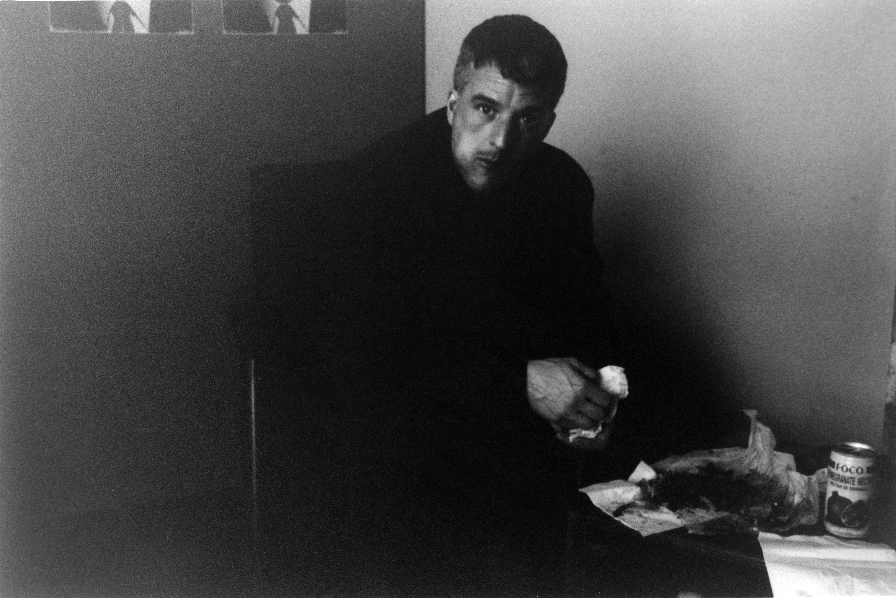

<!DOCTYPE html>
<html lang="en">
<head>
    <meta charset="UTF-8">
    <meta name="viewport" content="width=device-width, initial-scale=1.0">
    <link rel="stylesheet" href="style.css">
    <title>Federico Michettoni</title>
</head>
<body>

    <section class="gallery">
        

            
            
Photo Title 1

        

        

            
            
Photo Title 2

        

      

            
    </section>

    <footer>
        
&copy; 2023 Your Name Photography

    </footer>

</body>
</html>
